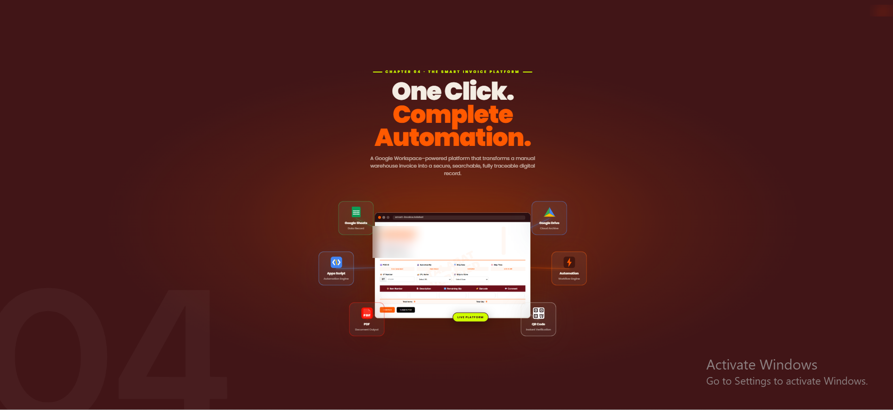
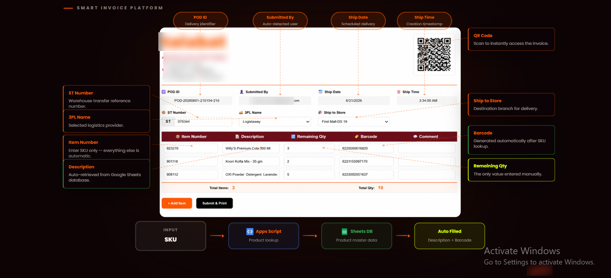
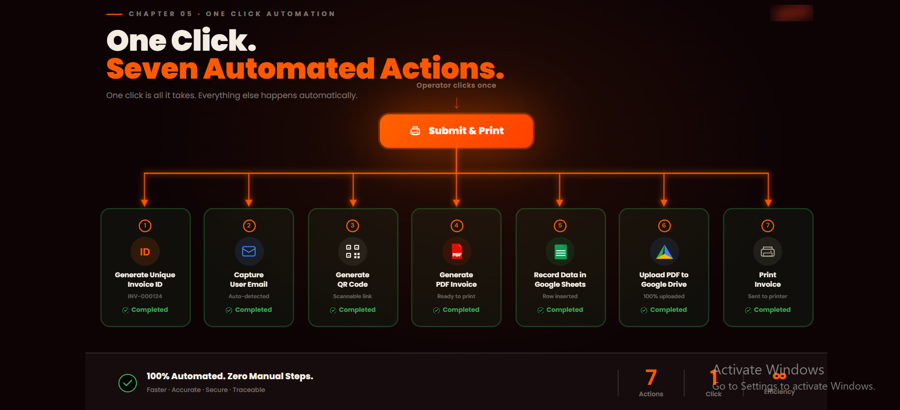
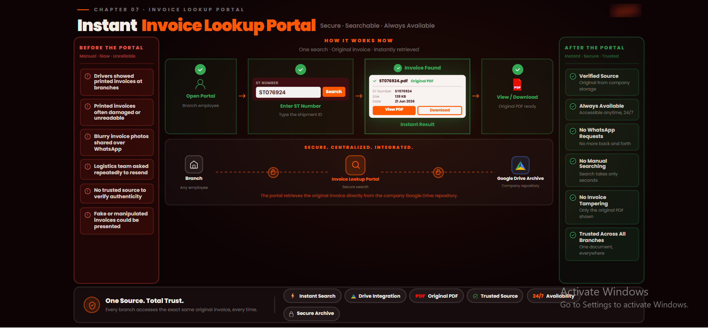

# 🧾 Smart Invoice Platform

A Google Workspace–powered automation platform that transforms manual warehouse invoices into secure, searchable, and fully traceable digital records — triggered by a single click.

---

## 🛠️ Tech Stack

---

## 📌 The Problem

Before this platform, warehouse invoicing was fully manual:

- Operators printed and filled invoices by hand
- Drivers shared blurry photos over WhatsApp when a copy was needed
- Printed invoices got damaged, lost, or manipulated
- No trusted source existed to verify invoice authenticity
- The logistics team was repeatedly asked to resend copies

---

## ✅ The Solution

### 1. Platform Overview

A single web app powered by Google Workspace — connecting Apps Script as the automation engine, Google Sheets as the product database, Google Drive as the cloud archive, and PDF as the output. One interface, fully integrated.

---

### 2. The Invoice Form

The operator enters only the **SKU (Item Number)** — everything else is automatic:

| Field | Source |
|---|---|
| POD ID | Auto-generated |
| Submitted By | Auto-detected (user email) |
| Ship Date & Time | Auto-filled (current timestamp) |
| Description | Auto-retrieved from Google Sheets DB |
| Barcode | Auto-retrieved from Google Sheets DB |
| Remaining Qty | The only manual input |

---

### 3. One Click → Seven Automated Actions

Clicking **Submit & Print** triggers 7 automated steps simultaneously:

| # | Action | Status |
|---|---|---|
| 1 | Generate unique Invoice ID | ✅ Auto |
| 2 | Capture submitting user's email | ✅ Auto |
| 3 | Generate scannable QR Code | ✅ Auto |
| 4 | Generate print-ready PDF invoice | ✅ Auto |
| 5 | Record data in Google Sheets | ✅ Auto |
| 6 | Upload PDF to Google Drive | ✅ Auto |
| 7 | Send invoice to printer | ✅ Auto |

---

### 4. Invoice Lookup Portal

Any branch employee can retrieve the original invoice instantly by entering the ST Number — no WhatsApp, no manual searching, no risk of a tampered copy. Every branch pulls from the same verified source.

---

## 📁 Repository Structure
